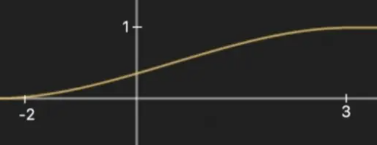
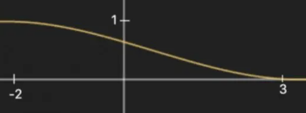
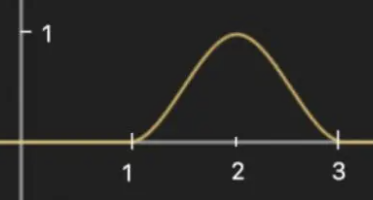
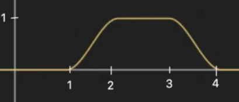

# Shader常用代码

## 法线相关

### 法线从切线转世界

```csharp
float3 normalTex =  UnpackNormalScale(tex2D( _NormalMap, IN.worldUV ),_NormalScale);
float3 worldTangent = IN.tangent;
float3 worldNormal = IN.normal;
float3 worldBitangent = IN.bitangent;
float3x3 tangentToWorld = float3x3(worldTangent.x,worldBitangent.x,worldNormal.x,                                        
                                   worldTangent.y,worldBitangent.y,worldNormal.y,
                                   worldTangent.z,worldBitangent.z,worldNormal.z);
float3 tangentToWorldDir = mul( tangentToWorld, normalTex );
```

### TANGENT_SPACE_ROTATION

```csharp
//TANGENT_SPACE_ROTATION
float3 binormal = cross( normalize(v.normal), normalize(v.tangent.xyz) ) * v.tangent.w; 
float3x3 rotation = float3x3( v.tangent.xyz, binormal, v.normal )
```

高度图转法线

```csharp
fixed4 frag (v2f i) : SV_Target
{
    float2 uvx0 = i.uv - float2(_MainTex_TexelSize.x, 0) * 0.5;
    float2 uvx1 = i.uv + float2(_MainTex_TexelSize.x, 0) * 0.5;
    float2 uvy0 = i.uv - float2(0, _MainTex_TexelSize.y) * 0.5;
    float2 uvy1 = i.uv + float2(0, _MainTex_TexelSize.y) * 0.5;
    float3 dx = float3(_MainTex_TexelSize.x,
        0,
        (1 - tex2D(_MainTex, uvx1).r) - (1 - tex2D(_MainTex, uvx0).r));
    float3 dy = float3(0,
        _MainTex_TexelSize.y,
        (1 - tex2D(_MainTex, uvy1).r) - (1 - tex2D(_MainTex, uvy0).r));
    float3 n = cross(dx, dy);
    n.z *= 10;//这里可以控制法线收束于z轴的程度
    float3 normal = normalize(n);
    normal = normal * 0.5 + 0.5;    
    return float4(normal, 1);
}
```

****

## 透明相关

### 半透明混合

```csharp
Tags { "RenderPipeline"="UniversalPipeline" "RenderType"="Transparent" "Queue"="Transparent" }
Blend SrcAlpha OneMinusSrcAlpha, One OneMinusSrcAlpha
```

### 透明Clip

`clip(col.a - 0.5)`

clip会丢弃小于0的片元

****

## include文件

```csharp
#include "Packages/com.unity.render-pipelines.universal/ShaderLibrary/Core.hlsl"
#include "Packages/com.unity.render-pipelines.universal/ShaderLibrary/Lighting.hlsl"
```

****

## 属性面板相关

#### 定义

```csharp
_Name("界面显示的名称",float) = defaultVal
_Name("标签名",range(minVal,maxVal)) = defaultVal

_Name("标签名",vector) = (x,y,z,w)
_Name("标签名",color) = (r,g,b,a)


_Name("标签名",2d) = "white"{}
```

#### Head

```csharp
[HideInInspector] -->在面板上隐藏
[NoScaleOffset]--> 禁用纹理平埔和位移
[HDR]--> 颜色开启HDR
[Header(Laber)]--> 排版标题
[Enum(UnityEngine.Rendering.BlendMode)] _SrcBlend ("Src Blend", Float) = 1 //混合方式 列表
[Enum(Off, 0, On, 1)] _ZWrite ("Z Write", Float) = 1 //枚举开关
[Toggle(_CLIPPING)] _Clipping ("Alpha Clipping", Float) = 0 //toggle开关
```

---

## 深度相关

> 摄像机远近

```csharp
// x = 1 or -1 (-1 if projection is flipped)
// y = near plane
// z = far plane
// w = 1/far plane
float4 _ProjectionParams;

float depth = -TransformWorldToView(worldPos).z;

float cameraDepthFade = ( depth -_ProjectionParams.y - _fadeDist ) / _fadeWidth;
```

- x 表明是不是反向投射

- y 近剪裁面在view空间(相机空间)的z值，数值上等于相机设置中的近剪裁面的值

- z 远剪裁面在view空间(相机空间)的z值，数值上等于相机设置中的远剪裁面的值

- depth 表示的是物体坐标转换到 摄像机视角 后距离 摄像机的距离

- 转换到view后，z轴存着深度

> 物体交接深度

```csharp
vertexshader : OUT.screenPos = ComputeScreenPos(positionInputs.positionCS);
float4 screenPos = IN.screenPos;
float4 screenPosNorm = screenPos / screenPos.w;
screenPosNorm.z = ( UNITY_NEAR_CLIP_VALUE >= 0 ) ? screenPosNorm.z : screenPosNorm.z * 0.5 + 0.5;
float screenDepth = LinearEyeDepth(tex2D(_CameraDepthTexture,screenPosNorm.xy),_ZBufferParams);
float distanceDepth = 1.0 - saturate( abs( ( screenDepth - LinearEyeDepth( screenPosNorm.z,_ZBufferParams ) ) /_DepthDistance ) );
```

- 裁剪空间(CS)下的齐次坐标，x和y的取值范围是[-w, w], w=-z。
  
  而屏幕空间(VS)下的齐次坐标取值范围是[0, w], w=-z。
  
  所以核心代码就是 float2 screenPos = (clipPos.xy + clipPos.w) / 2；
  
  最后通过透视除法之后xy的取值范围就是[0, 1]了。一般用来提取屏幕纹理
* 用ComputeScreenPos的结果，进行透视除法后，再乘以_ScreenParams.xy（xy分别是宽、高）后（即（screenPos.xy / screenPos.w） * _ScreenParams.xy），则可以得到<mark>真正的屏幕坐标</mark>。

* 需要注意的是screenPos透视除法这一步不能在顶点着色器中使用，透视除法之后会导致片元函数中插值结果错误

---

## GPU Instance

> shader部分：

```csharp
#pragma multi_compile_instancing
//#pragma vertex Vertex
//#pragma fragment Fragment
#include "Packages/com.unity.render-pipelines.core/ShaderLibrary/UnityInstancing.hlsl"

UNITY_INSTANCING_BUFFER_START(UnityPerMaterial)
    UNITY_DEFINE_INSTANCED_PROP(float4, _BaseColor)
UNITY_INSTANCING_BUFFER_END(UnityPerMaterial)

struct Attributes {
    //float3 positionOS : POSITION;
    UNITY_VERTEX_INPUT_INSTANCE_ID
};
struct Varyings {
    //float4 positionCS : SV_POSITION;
    UNITY_VERTEX_INPUT_INSTANCE_ID
};

Varyings Vertex (Attributes IN) { //: SV_POSITION {
    Varyings OUT;
    UNITY_SETUP_INSTANCE_ID(IN);
    UNITY_TRANSFER_INSTANCE_ID(IN, OUT);
    //output.positionCS = TransformObjectToHClip(input.positionOS);
    return OUT;
}

float4 Fragment (Varyings IN) : SV_TARGET {
    UNITY_SETUP_INSTANCE_ID(IN);
    return UNITY_ACCESS_INSTANCED_PROP(UnityPerMaterial, _BaseColor);
}
```

> c#部分：

```csharp
using System;
using System.Collections;
using System.Collections.Generic;
using UnityEngine;
using UnityEngine.UI;
using Random = UnityEngine.Random;

public class MeshBall : MonoBehaviour
{
        private static int baseColorId = Shader.PropertyToID("_BaseColor");
        [SerializeField]
        private Mesh _mesh = default;
        [SerializeField]
        private Material _material = default;

        private Matrix4x4[] matrices = new Matrix4x4[1023];//位置矩阵数组
        private Vector4[] baseColors = new Vector4[1023];//颜色数组

        private MaterialPropertyBlock block;

        private void Awake()
        {
                for (int i = 0; i < matrices.Length; i++)
                {
                        matrices[i] = Matrix4x4.TRS(Random.insideUnitSphere * 10f,Quaternion.identity, Vector3.one);
                        baseColors[i] = new Vector4(Random.value, Random.value, Random.value, 1f);
                }
        }

        private void Update()
        {
                if (block == null)
                {
                        block = new MaterialPropertyBlock();
                        block.SetVectorArray(baseColorId,baseColors);
                }

                Graphics.DrawMeshInstanced(_mesh, 0, _material, matrices, 1023, block);
        }
}
```

## 贴图采样

> 在 vertexshader 中采样贴图：

float noise += <mark>tex2Dlod</mark>(_NoiseTex, <mark>float4(v.uv, 0, 0)</mark>).r ;

> 获取反射贴图：

```csharp

float3 viewDirWS = normalize(_WorldSpaceCameraPos.xyz - IN.positionWS);
half3 reflectVector = reflect(-viewDirWS,reflectNormal);
half3 refcol = GlossyEnvironmentReflection(reflectVector,0.1,1);
```

## 常用函数解读：

#### Lerp

`lerp(a,b,t)`   a,b 需要同类型（float/vector）

 当 t = 0时返回a.当 t = 1时 返回b.

```csharp
float3 lerp(float3 a, float3 b, float t) { return a + t*(b-a); }
```

***

#### Step

`step(a,b)` a <= b,输出1，否则输出0

```csharp
step (a, x){
  if (x <= a)
    return 0;
  else
    return 1;
}
```

step 可以用来取代 if-else 代码

***

#### SmoothStep

`smoothstep(a,b,x)`  

```csharp
float smoothstep(float a, float b, float x) {
  x = clamp((x - a) / (b- a), 0.0, 1.0); 
  return x * x * (3 - 2 * x);
}
```

在 a < b 的情况下，当 x < a 时，返回 0，当 x > b 时，返回 1，否则在 0和 1之间平滑过渡

例如`smoothstep(-2, 3, x)`的函数图像如下:



在 a > b 的情况下，当 x < b 时，返回1，当 x > a 时，返回0，否则在 1 和 0 之间平滑过渡

例如 `smoothstep(3, -2, x)`的函数图像如下：



例如 `smoothstep(1, 2, x) - smoothstep(2, 3, x)`的函数图像：



`smoothstep(1,2, x) - smoothstep(3, 4, x)`，图像如下：



***
