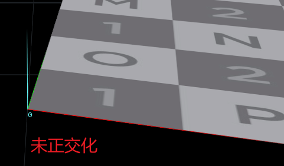
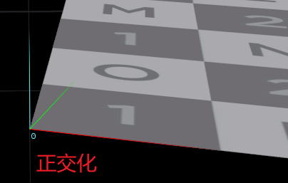
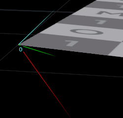

# 基本概念：

1. 切线空间定义于每一个顶点之中

2. 切线空间的N轴就是顶点法线，建模软件中但凡是出现单个顶点包含多条法线（split vertex normal）的，在实际导出后，都是变为多个重合顶点，**一个顶点只有一条法线**，这是任何时候都不会改变的事实

3. uv二轴在三维空间下的方向很可能不垂直(见下图正交化后的tb)

4. 顶点法线与面法线并无关联，面法线只是垂直于面的一条向量，规定了面的正反，**顶点法线才是用于光照信息的处理**，只有当在建模软件中对物体进行了平滑着色后，才会根据面法线平均得到顶点法线（如blender中为shader smooth命令）

5. 三维空间下三角形中的每一个点都必能在uv上找到对应的点，反之亦然

****

### 公式：

假设三角形ABC的三个顶点以逆时针排列，则对于顶点A，E1=向量AB、E2=向量AC、delta_uv1=uv坐标上的向量AB、delta_uv2=uv坐标上的向量AC。其中T代表Tangent切线，B代表Bitangent副切线。

$$
T = \frac{\Delta V1E2-\Delta V2E1}{\Delta V1\Delta U2 - \Delta V2 \Delta U1}  \ \ \ \ \ \ \
B = \frac{-\Delta U1E2+\Delta U2E1}{\Delta V1\Delta U2 - \Delta V2 \Delta U1}
$$

$$
t = nrm(t-dot(t,n)*n)  \\ b = nrm(b-dot(b,n)*n-dot(b,t)*t) \ \ || = cross(n,t)
$$

*****

### 代码：

```csharp
vector3 e1 = pos1 - pos0;
vector3 e2 = pos2 - pos0;


float delta_u1 = uvpos1.x - uvpos0.x;
float delta_u2 = uvpos2.x - uvpos0.x;
float delta_v1 = uvpos1.y - uvpos0.y;
float delta_v2 = uvpos2.y - uvpos0.y;

//中间值
vector3 tangent = (delta_v1 * e2 - delta_v2 * e1) / (delta_v1 * delta_u2 - delta_v2 * delta_u1);
vector3 bitangent = (-delta_u1 * e2 + delta_u2 * e1 ) / (delta_v1*  delta_u2 - delta_v2 * delta_u1);

//正交化
vector3 normal = vertex.normal;
tangent = normalize(tangent - dot(tangent,normal) * normal);
bitangent = normalize(bitangent - dot(bitangent,normal) * normal - dot(bitangent,tangent) * tangent);
```

```csharp
//bitangent由于uv拉伸等原因算出来可能不会与tangent垂直，所以可以直接由cross得出
vector e1 = pos2 - pos0;
vector e2 = pos1 - pos0;

vector2 deltaUV1 = uv1-uv0;
vector2 deltaUV2 = uv2-uv0;

float f = 1.0f / (deltaUV1.x * deltaUV2.y - deltaUV2.x * deltaUV1.y);
vector tangent;
tangent.x = f * (deltaUV2.y * e1.x - deltaUV1.y * e2.x);
tangent.y = f * (deltaUV2.y * e1.y - deltaUV1.y * e2.y);
tangent.z = f * (deltaUV2.y * e1.z - deltaUV1.y * e2.z);
tangent = normalize(tangent);

vector bitangent;
/*bitangent.x = f*(-deltaUV2.x* e1.x + deltaUV1.x * e2.x);
bitangent.y = f*(-deltaUV2.x* e1.y + deltaUV1.x * e2.y);
bitangent.z = f*(-deltaUV2.x* e1.z + deltaUV1.x * e2.z);
bitangent = normalize(bitangent);*/
vector normal = point(0,"N",0);
bitangent = cross(normal,tangent);
```

****

没有正交化之前的T，B向量平行于U，V





当顶点法线在建模软件中被修改为不垂直于该面片时，TB平面甚至不在三角形面片上：



TBN矩阵：

> 计算tangent和bitangent时，使用的position是哪个空间，即是将这个空间的向量转换到切线空间

该矩阵可以将当前空间向量转换到 切线空间

M(tan) = { T.x,B.x,N.x,

                  T.y,B.y,N.y,

                  T.z,B.z,N.z }

该矩阵可以将 切线空间 下的向量转换到原来的空间

由于TBN矩阵是正交矩阵，所以它的逆（inverse）也是它的转置（transpose）

M(world) = { T.x,T.y,T.z,

                      B.x,B.y,B.z,

                      N.x,N.y,N.z }
